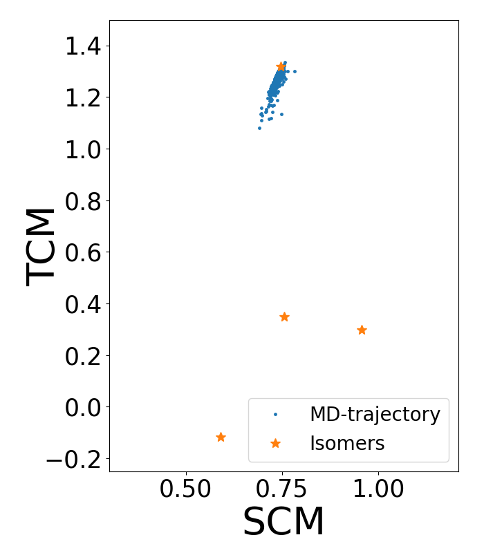

## Molecular Dynamics Simulation

Let's start with a Langevin simulation without bias. In LJ dimensionless 
reduced units (assuming $\epsilon$ = 1 eV, $\sigma$ = 1 $\textrm Å$ and 
m = 1 a.m.u), the parameters of the simulation are  $k_\text{B}T=0.1$, 
friction coefficient fixed equal to 1 and a time step of 0.005.

In principle, the system should explore all the configuration space 
due to thermal fluctuations. However, we can see that the system remains in the 
same conformational state, even when we simulate for a long time. This happens because the system gets trapped in a local minimum and a 
complete exploration of the configuration 
space is too computationally expensive. Figure 2 -blue 
dots- shows the trajectory obtained from the following unbiased 
Molecular Dynamics [`MD.py`](https://github.com/Sucerquia/ASE-PLUMED_tutorial/blob/master/files/MD.py):

```python
from ase.calculators.lj import LennardJones
from ase.calculators.plumed import Plumed
from ase.constraints import FixedPlane
from ase.md.langevin import Langevin
from ase.io import read
from ase import units


timestep = 0.005

ps = 1000 * units.fs
setup = open("plumedLJ.dat", "r").read().splitlines()

atoms = read('isomer.xyz')
# Constraint to keep the system in a plane
cons = [FixedPlane(i, [0, 0, 1]) for i in range(7)]
atoms.set_constraint(cons)
atoms.set_masses([1, 1, 1, 1, 1, 1, 1])

atoms.calc = Plumed(calc=LennardJones(rc=2.5, r0=3.),
                    input=setup,
                    timestep=timestep,
                    atoms=atoms,
                    kT=0.1)

dyn = Langevin(atoms, timestep, temperature_K=0.1/units.kB, friction=1,
               fixcm=False, trajectory='UnbiasMD.xyz')

dyn.run(100000)
```

Where [`plumedLJ.dat`](https://github.com/Sucerquia/ASE-PLUMED_tutorial/blob/master/files/plumedLJ.dat) contains the next information:

```plumed
UNITS LENGTH=A TIME=0.0101805 ENERGY=96.4853329
c1: COORDINATIONNUMBER SPECIES=1-7 MOMENTS=2-3 SWITCH={RATIONAL R_0=1.5 NN=8 MM=16}
PRINT ARG=c1.* STRIDE=100 FILE=COLVAR
FLUSH STRIDE=1000
```

This simulation starts from the configuration of minimum energy, whose 
coordinates are imported from [`isomerLJ.xyz`](https://github.com/Sucerquia/ASE-PLUMED_tutorial/blob/master/files/isomer.xyz).
As you can see in Figure 2, the 
system remains around that state and it does not jump to the other 
isomers, thereby not fully sampling all possible 
configurations of the system. It is therefore necessary  to use an enhanced
sampling method.
In this tutorial, we implement Well-Tempered Metadynamics.


| **WARNING** |
| ---         |
| Note that in the plumed setup, there is a line with the keyword `UNITS`, which is necessary because all parameters and output files are assumed to be in plumed internal units. This line is important to maintain the units of all plumed parameters and outputs in ASE units. You can ignore this line if you are aware of the unit  conversion.   |


### Post Processing Analysis

Once you have the trajectory of an MD simulation and you want to compute a set of 
CVs of that trajectory, you can reconstruct the plumed files without running 
again the simulation. As an example, let's use the trajectory created in 
the last example to rewrite the COLVAR file with the code [`postpro.py`](https://github.com/Sucerquia/ASE-PLUMED_tutorial/blob/master/files/postpro.py):

```python
from ase.calculators.idealgas import IdealGas
from ase.calculators.plumed import Plumed
from ase.io import read
from ase import units


traj = read('UnbiasMD.xyz', index=':')

atoms = traj[0]

timestep = 0.005
ps = 1000 * units.fs
setup = open("plumedLJ.dat", "r").read().splitlines()

# IdealGas is a calculator that removes all ineractions.
calc = Plumed(calc=IdealGas(),
              input=setup,
              timestep=timestep,
              atoms=atoms,
              kT=0.1)

calc.write_plumed_files(traj)
```

This code, as well as the previous one, generates a file called COLVAR with 
the value of the CVs. All PLUMED files begin with a header that describes the 
fields that it contains. In this case, the header looks like:

```
$ head -n 2 COLVAR
#! FIELDS time c1.moment-2 c1.moment-3
0.000000 0.757954 1.335796
```

As you can see, the first column corresponds to the time, the second one is the 
second central moment (SCM) and the third column is the third central moment 
(TCM). When we plot this trajectory in the space of these CVs (that is, the 
second and third columns) we obtain this result:

<div align="center">
  
</div>

**Figure 2.** Unbiased MD trajectory (blue dots) in the space of the collective
variables second and third central moment. Orange stars represent the location of
the local minima isomers of the LJ cluster in this space.

Note that the system remains confined in the same stable state. Therefore, the MD simulation is too short and it is not possible to explore all configurations or to obtain
a statistical study of the possible configurations of the system. An alternative is to use an enhanced sampling 
method. In this case, we implement Well-Tempered Metadynamics for 
reconstructing the Free Energy Surface (FES).

##### [&larr; Toy model: Planar 7-Atoms Cluster](defsystem.md)
##### [Biased simulation: Well Tempered Metadynamics &rarr;](MTD.md)
