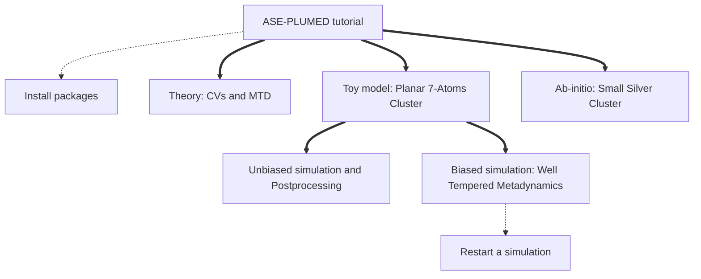

# ASE-PLUMED Tutorial
### A tutorial about the ASE-PLUMED calculator presented in https://doi.org/10.1063/5.0082332
by Daniel Sucerquia, Pilar Cossio and Olga Lopez-Acevedo.

This tutorial shows how to use the [plumed calculator](https://wiki.fysik.dtu.dk/ase/ase/calculators/plumed.html)
in [ASE](https://wiki.fysik.dtu.dk/ase/).

The Atomic Simulation Environment, [ASE](https://wiki.fysik.dtu.dk/ase/), is a package that allows to set up,
run and visualize atomistic simulations. It is interfaced with some [other codes](https://wiki.fysik.dtu.dk/ase/#supported-calculators),
which use quantum or classical methods.  We developed a [plumed calculator](https://wiki.fysik.dtu.dk/ase/ase/calculators/plumed.html) to connect PLUMED with all the other codes interfaced in ASE.  We note that PLUMED allows several actions besides of what we show in this tutorial. For further description, visit [plumed web page](http://www.plumed.org/doc). 

This tutorial begins with a brief explanation of the basic ideas about metadynamics. We first use a toy model to show how to compute collective variables on-the-fly in an MD simulation, and also from a previously computed MD trajectory using postprocesing. We then implement Well-Tempered Metadynamics to reconstruct the free energy surface of the toy system along a set of collective variables. All the files required to complete this tutorial are publicly available in [https://github.com/Sucerquia/ASE-PLUMED_tutorial/blob/master/files](https://github.com/Sucerquia/ASE-PLUMED_tutorial/blob/master/files).

| **WARNING** |
| ---         |
| In order to complete this tutorial you have to install [py-plumed](https://www.plumed.org/doc-v2.8/user-doc/html/_installation.html#installingpython) and version of [ASE](https://gitlab.com/ase/ase) >= 3.23.0. For further details, check [installation instructions](install.md).|

##### [Theory: CVs and MTD &rarr;](theory.md)
