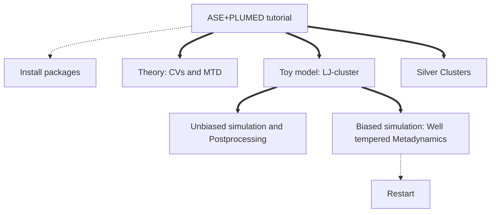

```mermaid
flowchart TB;
  A[ASE+PLUMED tutorial] -.-> B[Install packages]
  A ==> C[Theory: CVs and MTD]
  A ==> D[Toy model: LJ-cluster]
  D ==> E[Unbiased simulation and Postprocessing]
  D ==> F[Biased simulation: Well tempered Metadynamics]
  F -.-> G[Restart]
  A ==> H[Silver Clusters]

  click A "INSTRUCTIONS.md" "Introduction to the tutorial";
  click B "install.md" "Install py-plumed and ASE"
  click C "theory.md" "Theory necessary to follow completely this tutorial"
  click D "defsystem.md" "Toy model showing the use of PLUMED in ASE"
  click E "MD.md" "Unbiased simulation computing CVs on the fly and by postprocessing"
  click F "MTD.md" "Addition of the bias using metadynamics"
  click G "restart.md" "How to restart a simulation in ASE"
```