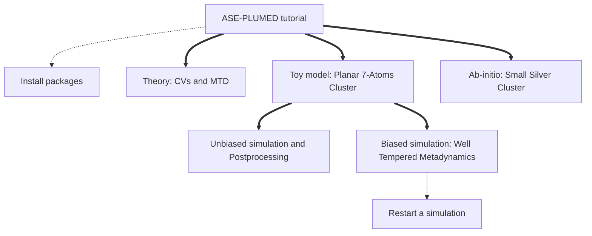

# ASE-PLUMED Calculator Tutorial
### Tutorial about the calculator presented in the paper: https://doi.org/10.1063/5.0082332
by Daniel Sucerquia, Pilar Cossio and Olga Lopez-Acevedo. March, 2022

This tutorial shows how to use the [plumed calculator](https://wiki.fysik.dtu.dk/ase/ase/calculators/plumed.html)
of [ASE](https://wiki.fysik.dtu.dk/ase/). As a proof-of-concept, we use a toy model to compute
some collective variables on-the-fly during a Molecular Dynamics
simulation (MD) and by post-processing a trajectory. From this first simulation it is clear that
simple MD is not enough to complete an exploration of the free energy landscape and it is necessary to
apply Well-Tempered Metadynamics. Finally, we show how
to reconstruct the free energy surface of a small cluster of silver atoms using Ab-initio Molecular
Dynamics.

The Atomic Simulation Environment, [ASE](https://wiki.fysik.dtu.dk/ase/), is a package that allows to set up,
run and visualize atomistic simulations. It is interfaced with some [other codes](https://wiki.fysik.dtu.dk/ase/#supported-calculators),
which use quantum or classical methods. In other words, this tutorial shows how to connect PLUMED to
all the other codes interfaced in ASE.

Plumed, in the other hand, allows several actions besides of what we show here. For further description of plumed details, visit [plumed web page](http://www.plumed.org/doc). The usage of other tools of Plumed with ASE is absolutely analogous to what is explain here.

This tutorial begins with a brief explanation of basic ideas about metadynamics. Then, we use a toy model to show how to compute collective variables on-the-fly in an MD simulation. We obtain again the last results, but from the trajectory using postprocesing. Finally, we implement Well-Tempered Metadynamics to reconstruct the free energy surface of the toy model after a complete exploration of the configuration landscape. All the files required to complete this tutorial are publicly available.

| **WARNING** |
| ---         |
| In order to complete this tutorial you have to install [py-plumed](https://www.plumed.org/doc-v2.8/user-doc/html/_installation.html#installingpython) and version of [ASE](https://gitlab.com/ase/ase) >= 3.23.0. For further details, check [installation instructions](install.md).|

##### [Theory: CVs and MTD &rarr;](theory.md)
